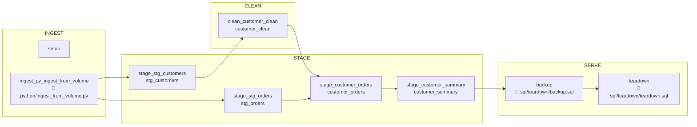
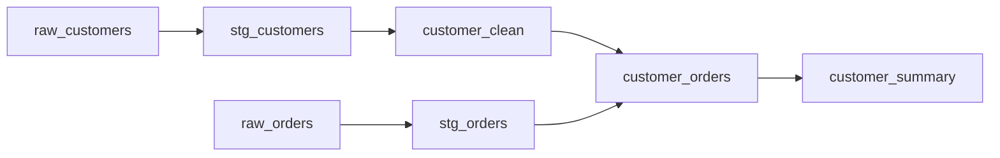
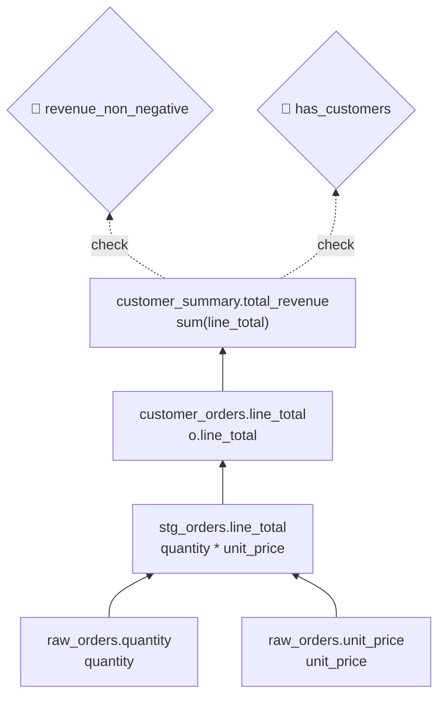

# Visual Documentation

## Pipeline Workflow

```mermaid
flowchart LR
    subgraph INGEST
        setup["setup<br/>"]
        ingest_py_ingest_from_volume["ingest_py_ingest_from_volume<br/>🐍 python/ingest_from_volume.py"]
    end
    subgraph STAGE
        stage_customer_orders["stage_customer_orders<br/>customer_orders"]
        stage_customer_summary["stage_customer_summary<br/>customer_summary"]
        stage_stg_customers["stage_stg_customers<br/>stg_customers"]
        stage_stg_orders["stage_stg_orders<br/>stg_orders"]
    end
    subgraph CLEAN
        clean_customer_clean["clean_customer_clean<br/>customer_clean"]
    end
    subgraph SERVE
        backup["backup<br/>📄 sql/teardown/backup.sql"]
        teardown["teardown<br/>📄 sql/teardown/teardown.sql"]
    end

    %% === Data flow (all connections at the bottom) ===
    clean_customer_clean --> stage_customer_orders
    stage_stg_orders --> stage_customer_orders
    stage_customer_orders --> stage_customer_summary
    ingest_py_ingest_from_volume --> stage_stg_customers
    ingest_py_ingest_from_volume --> stage_stg_orders
    stage_stg_customers --> clean_customer_clean
    backup --> teardown
    stage_customer_summary --> backup
```

## Table Lineage

```mermaid
flowchart LR
    customer_clean["customer_clean"]
    customer_orders["customer_orders"]
    customer_summary["customer_summary"]
    raw_customers["raw_customers"]
    raw_orders["raw_orders"]
    stg_customers["stg_customers"]
    stg_orders["stg_orders"]
    raw_customers --> stg_customers
    raw_orders --> stg_orders
    stg_customers --> customer_clean
    customer_orders --> customer_summary
    customer_clean --> customer_orders
    stg_orders --> customer_orders
```

## Column Lineage: customer_summary.total_revenue

```mermaid
graph BT
    customer_summary_total_revenue["customer_summary.total_revenue<br/>sum(line_total)"]
    chk_customer_summary_revenue_non_negative{"🔴 revenue_non_negative"}
    customer_summary_total_revenue -.->|check| chk_customer_summary_revenue_non_negative
    chk_customer_summary_has_customers{"🔴 has_customers"}
    customer_summary_total_revenue -.->|check| chk_customer_summary_has_customers
    customer_orders_line_total["customer_orders.line_total<br/>o.line_total"]
    customer_orders_line_total --> customer_summary_total_revenue
    stg_orders_line_total["stg_orders.line_total<br/>quantity * unit_price"]
    stg_orders_line_total --> customer_orders_line_total
    raw_orders_quantity["raw_orders.quantity<br/>quantity"]
    raw_orders_quantity --> stg_orders_line_total
    raw_orders_unit_price["raw_orders.unit_price<br/>unit_price"]
    raw_orders_unit_price --> stg_orders_line_total
```
