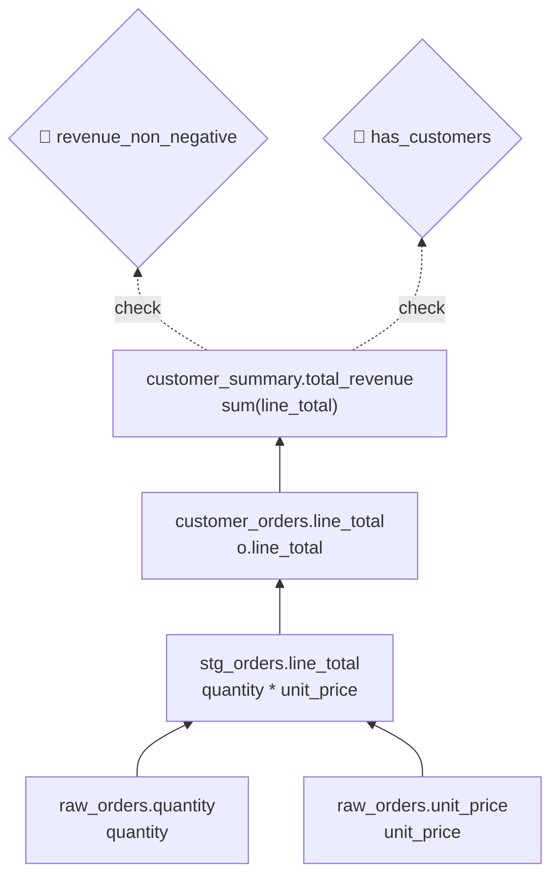

```mermaid
graph BT
    customer_summary_total_revenue["customer_summary.total_revenue<br/>sum(line_total)"]
    chk_customer_summary_revenue_non_negative{"🔴 revenue_non_negative"}
    customer_summary_total_revenue -.->|check| chk_customer_summary_revenue_non_negative
    chk_customer_summary_has_customers{"🔴 has_customers"}
    customer_summary_total_revenue -.->|check| chk_customer_summary_has_customers
    customer_orders_line_total["customer_orders.line_total<br/>o.line_total"]
    customer_orders_line_total --> customer_summary_total_revenue
    stg_orders_line_total["stg_orders.line_total<br/>quantity * unit_price"]
    stg_orders_line_total --> customer_orders_line_total
    raw_orders_quantity["raw_orders.quantity<br/>quantity"]
    raw_orders_quantity --> stg_orders_line_total
    raw_orders_unit_price["raw_orders.unit_price<br/>unit_price"]
    raw_orders_unit_price --> stg_orders_line_total
```
