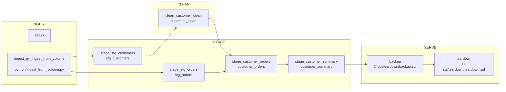

```mermaid
flowchart LR
    subgraph INGEST
        setup["setup<br/>"]
        ingest_py_ingest_from_volume["ingest_py_ingest_from_volume<br/>🐍 python/ingest_from_volume.py"]
    end
    subgraph STAGE
        stage_customer_orders["stage_customer_orders<br/>customer_orders"]
        stage_customer_summary["stage_customer_summary<br/>customer_summary"]
        stage_stg_customers["stage_stg_customers<br/>stg_customers"]
        stage_stg_orders["stage_stg_orders<br/>stg_orders"]
    end
    subgraph CLEAN
        clean_customer_clean["clean_customer_clean<br/>customer_clean"]
    end
    subgraph SERVE
        backup["backup<br/>📄 sql/teardown/backup.sql"]
        teardown["teardown<br/>📄 sql/teardown/teardown.sql"]
    end

    %% === Data flow (all connections at the bottom) ===
    clean_customer_clean --> stage_customer_orders
    stage_stg_orders --> stage_customer_orders
    stage_customer_orders --> stage_customer_summary
    ingest_py_ingest_from_volume --> stage_stg_customers
    ingest_py_ingest_from_volume --> stage_stg_orders
    stage_stg_customers --> clean_customer_clean
    backup --> teardown
    stage_customer_summary --> backup
```
