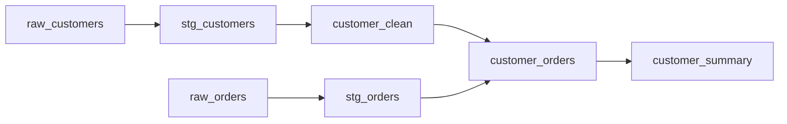

```mermaid
flowchart LR
    customer_clean["customer_clean"]
    customer_orders["customer_orders"]
    customer_summary["customer_summary"]
    raw_customers["raw_customers"]
    raw_orders["raw_orders"]
    stg_customers["stg_customers"]
    stg_orders["stg_orders"]
    raw_customers --> stg_customers
    raw_orders --> stg_orders
    stg_customers --> customer_clean
    customer_orders --> customer_summary
    customer_clean --> customer_orders
    stg_orders --> customer_orders
```
