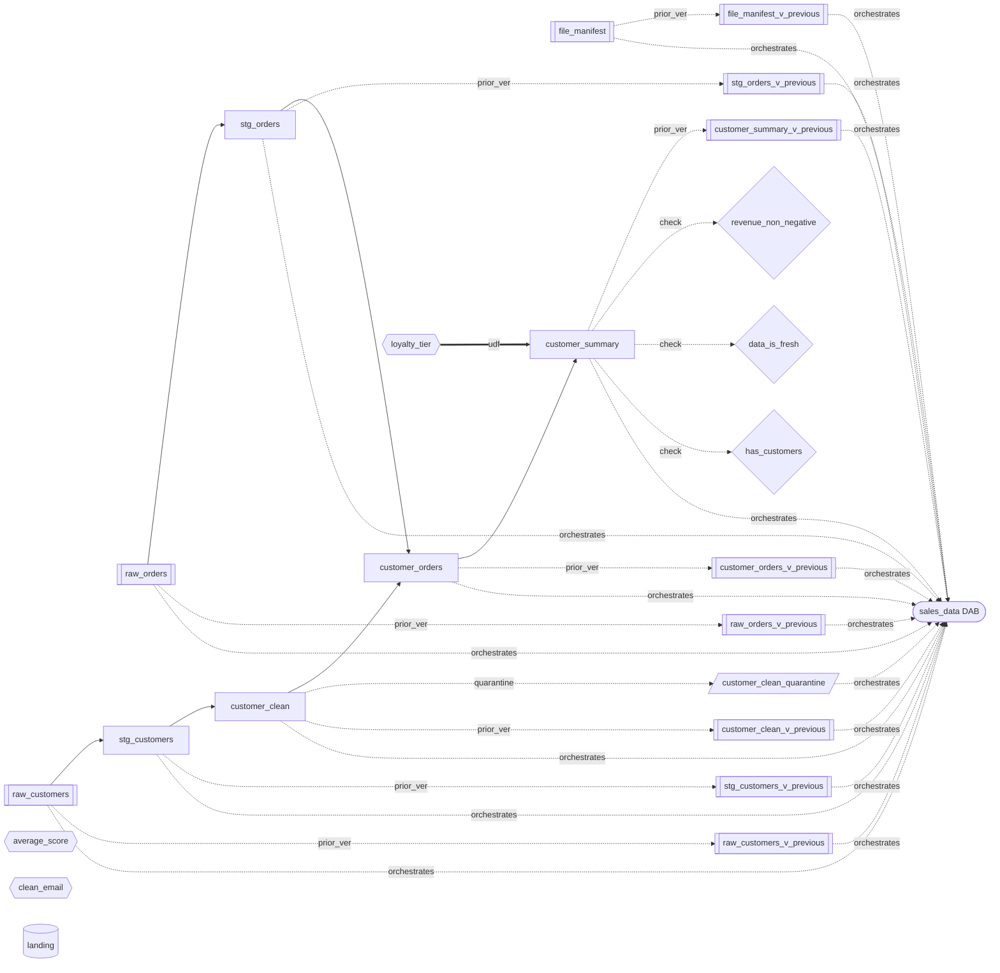

```mermaid
graph LR
    model_sales_data_raw_customers[["raw_customers"]]
    model_sales_data_raw_orders[["raw_orders"]]
    model_sales_data_file_manifest[["file_manifest"]]
    model_sales_data_stg_customers["stg_customers"]
    model_sales_data_stg_orders["stg_orders"]
    model_sales_data_customer_clean["customer_clean"]
    model_sales_data_customer_summary["customer_summary"]
    model_sales_data_customer_orders["customer_orders"]
    model_sales_data_customer_clean_quarantine[/"customer_clean_quarantine"/]
    model_sales_data_raw_customers_v_previous[["raw_customers_v_previous"]]
    model_sales_data_raw_orders_v_previous[["raw_orders_v_previous"]]
    model_sales_data_file_manifest_v_previous[["file_manifest_v_previous"]]
    model_sales_data_stg_customers_v_previous[["stg_customers_v_previous"]]
    model_sales_data_stg_orders_v_previous[["stg_orders_v_previous"]]
    model_sales_data_customer_clean_v_previous[["customer_clean_v_previous"]]
    model_sales_data_customer_summary_v_previous[["customer_summary_v_previous"]]
    model_sales_data_customer_orders_v_previous[["customer_orders_v_previous"]]
    udf_sales_data_average_score{{average_score}}
    udf_sales_data_clean_email{{clean_email}}
    udf_sales_data_loyalty_tier{{loyalty_tier}}
    check_sales_data_customer_summary_revenue_non_negative{"revenue_non_negative"}
    check_sales_data_customer_summary_data_is_fresh{"data_is_fresh"}
    check_sales_data_customer_summary_has_customers{"has_customers"}
    workflow_sales_data(["sales_data DAB"])
    volume_sales_data_landing[("landing")]
    model_sales_data_raw_customers --> model_sales_data_stg_customers
    model_sales_data_raw_orders --> model_sales_data_stg_orders
    model_sales_data_stg_customers --> model_sales_data_customer_clean
    model_sales_data_customer_orders --> model_sales_data_customer_summary
    model_sales_data_customer_clean --> model_sales_data_customer_orders
    model_sales_data_stg_orders --> model_sales_data_customer_orders
    model_sales_data_customer_clean -.->|quarantine| model_sales_data_customer_clean_quarantine
    model_sales_data_raw_customers -.->|prior_ver| model_sales_data_raw_customers_v_previous
    model_sales_data_raw_orders -.->|prior_ver| model_sales_data_raw_orders_v_previous
    model_sales_data_file_manifest -.->|prior_ver| model_sales_data_file_manifest_v_previous
    model_sales_data_stg_customers -.->|prior_ver| model_sales_data_stg_customers_v_previous
    model_sales_data_stg_orders -.->|prior_ver| model_sales_data_stg_orders_v_previous
    model_sales_data_customer_clean -.->|prior_ver| model_sales_data_customer_clean_v_previous
    model_sales_data_customer_summary -.->|prior_ver| model_sales_data_customer_summary_v_previous
    model_sales_data_customer_orders -.->|prior_ver| model_sales_data_customer_orders_v_previous
    udf_sales_data_loyalty_tier ==>|udf| model_sales_data_customer_summary
    model_sales_data_customer_summary -.->|check| check_sales_data_customer_summary_revenue_non_negative
    model_sales_data_customer_summary -.->|check| check_sales_data_customer_summary_data_is_fresh
    model_sales_data_customer_summary -.->|check| check_sales_data_customer_summary_has_customers
    model_sales_data_raw_customers -.->|orchestrates| workflow_sales_data
    model_sales_data_raw_orders -.->|orchestrates| workflow_sales_data
    model_sales_data_file_manifest -.->|orchestrates| workflow_sales_data
    model_sales_data_stg_customers -.->|orchestrates| workflow_sales_data
    model_sales_data_stg_orders -.->|orchestrates| workflow_sales_data
    model_sales_data_customer_clean -.->|orchestrates| workflow_sales_data
    model_sales_data_customer_summary -.->|orchestrates| workflow_sales_data
    model_sales_data_customer_orders -.->|orchestrates| workflow_sales_data
    model_sales_data_customer_clean_quarantine -.->|orchestrates| workflow_sales_data
    model_sales_data_raw_customers_v_previous -.->|orchestrates| workflow_sales_data
    model_sales_data_raw_orders_v_previous -.->|orchestrates| workflow_sales_data
    model_sales_data_file_manifest_v_previous -.->|orchestrates| workflow_sales_data
    model_sales_data_stg_customers_v_previous -.->|orchestrates| workflow_sales_data
    model_sales_data_stg_orders_v_previous -.->|orchestrates| workflow_sales_data
    model_sales_data_customer_clean_v_previous -.->|orchestrates| workflow_sales_data
    model_sales_data_customer_summary_v_previous -.->|orchestrates| workflow_sales_data
    model_sales_data_customer_orders_v_previous -.->|orchestrates| workflow_sales_data
```
